# Skilly — Entity-Relationship Diagram

**Revision note:** this ERD extends the original Figure 4.1 from the thesis. Building the Figma mockups surfaced gaps between the original diagram and what the actual screens require — three new entities for persisting AI output, plus four field-level fixes. See "Changes from Figure 4.1" at the bottom.

## Diagram

```mermaid
erDiagram
    USER ||--o{ ACCOUNT : "links"
    USER ||--|| PROFILE : "has"
    USER ||--o{ WORK_EXPERIENCE : "lists"
    USER ||--o{ USER_SKILL : "has"
    USER ||--o{ CERTIFICATION : "earns"
    USER ||--o{ USER_LANGUAGE : "speaks"
    USER ||--o{ SKILL_ASSESSMENT : "takes"
    USER ||--|| CAREER_INTERESTS : "sets"
    USER ||--o{ RECOMMENDATION : "receives"
    USER ||--o{ SAVED_CAREER_PATH : "saves"
    USER ||--o{ SKILL_GOAL : "tracks"
    SKILL ||--o{ USER_SKILL : "assigned via"
    LANGUAGE ||--o{ USER_LANGUAGE : "assigned via"

    USER {
        string id PK
        string name
        string email UK
        datetime emailVerified
        string image
        string password
        string role
        datetime createdAt
        datetime updatedAt
        boolean isOnboarded
    }

    ACCOUNT {
        string type
        string provider PK
        string providerAccountId PK
        string refresh_token
        string access_token
        int expires_at
        string token_type
        string scope
        string id_token
        string session_state
        string userId FK
    }

    VERIFICATION_TOKEN {
        string id PK
        string email
        string token UK
        datetime expires
    }

    PROFILE {
        string id PK
        string userId FK
        string jobTitle
        string highestDegree
        string fieldOfStudy
        string academicAchievements
    }

    WORK_EXPERIENCE {
        string id PK
        string userId FK
        string jobTitle
        string company "ADDED"
        string rolesAndResponsibilities
        boolean isInternship
        datetime startDate
        datetime endDate
    }

    SKILL {
        string id PK
        string name UK
        string type "enum: PROGRAMMING_LANGUAGE | FRAMEWORK | SOFT_SKILL"
    }

    USER_SKILL {
        string id PK
        string userId FK
        string skillId FK
        int proficiency
    }

    CERTIFICATION {
        string id PK
        string userId FK
        string name
        string platform
        datetime completionDate
        datetime expirationDate "ADDED"
        string credentialUrl "ADDED"
    }

    LANGUAGE {
        string id PK
        string name UK
    }

    USER_LANGUAGE {
        string id PK
        string userId FK
        string languageId FK
        string proficiency
    }

    SKILL_ASSESSMENT {
        string id PK
        string userId FK
        string assessment
        int score
        datetime takenAt
    }

    CAREER_INTERESTS {
        string id PK
        string userId FK
        string_array preferredJobRoles "CHANGED to list"
        string preferredIndustries
        string careerGoals
        string githubUrl
        string portfolioUrl
        string linkedinUrl
    }

    RECOMMENDATION {
        string id PK
        string userId FK
        json careerPaths "NEW"
        json skillGaps "NEW"
        json inDemandSkills "NEW"
        datetime createdAt
    }

    SAVED_CAREER_PATH {
        string id PK
        string userId FK
        string title "NEW"
        datetime savedAt
    }

    SKILL_GOAL {
        string id PK
        string userId FK
        string skillName "NEW"
        string courseTitle
        string courseUrl
        boolean isCompleted
        datetime createdAt
    }
```

## Entities

| Entity | Purpose |
|---|---|
| **User** | Central entity — identity, credentials, role, onboarding status |
| **Account** | NextAuth OAuth provider linking |
| **VerificationToken** | Email verification / magic-link tokens |
| **Profile** | Academic identity: job title, degree, field of study, achievements |
| **WorkExperience** | Job/internship history, including the company/organization name |
| **Skill** | Master list of skills, categorized by `SkillType` |
| **UserSkill** | Join table: user's skills with proficiency |
| **Certification** | Certifications earned, including expiration and verification link |
| **Language** | Master list of languages |
| **UserLanguage** | Join table: user's languages with proficiency |
| **SkillAssessment** | Assessment results/scores over time |
| **CareerInterests** | Stated career goals — now supports multiple preferred job roles as a list |
| **Recommendation** | *(new)* A snapshot of AI output — career paths, skill gaps, in-demand skills — saved with a timestamp so the dashboard has real history |
| **SavedCareerPath** | *(new)* A career path the user has explicitly bookmarked from a Recommendation |
| **SkillGoal** | *(new)* An AI-suggested skill-to-develop, optionally paired with a suggested course, with a completion checkbox the user can toggle |

## Relationships

Same as before, plus:
- **User – Recommendation**: one-to-many — every AI analysis run is saved, not overwritten.
- **User – SavedCareerPath**: one-to-many — a user can bookmark several career paths over time.
- **User – SkillGoal**: one-to-many — a growing, checkable list of skill-development goals with attached course suggestions.

## Changes from Figure 4.1

| Change | Reason |
|---|---|
| Added `Recommendation`, `SavedCareerPath`, `SkillGoal` entities | The dashboard mockup shows "Recent Activity" (timestamped history), a "Saved" career path, and a checkable "Skills to Develop" list with course suggestions — none of this is possible without persistence. The original design ("recommendations generated live, not stored") could not support these screens. |
| `WorkExperience.company` added | Mockup's work experience form has a "Company/Organization" field; the original ERD had no equivalent field at all. |
| `Certification.expirationDate`, `Certification.credentialUrl` added | Mockup's certification form includes both fields; original ERD only had name, platform, completionDate. |
| `CareerInterests.preferredJobRoles` changed from `String` to `String[]` | Mockup shows this as multiple removable tags (e.g. "Product Manager" ✕), which a single string field can't represent cleanly. |

This is a deliberate, documented revision on top of the thesis-approved design — worth noting explicitly if defending after these changes, since Figure 4.1 as originally drawn does not include the three new entities.
